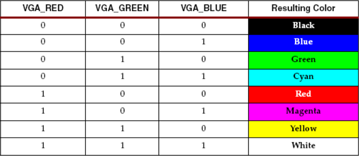
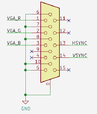
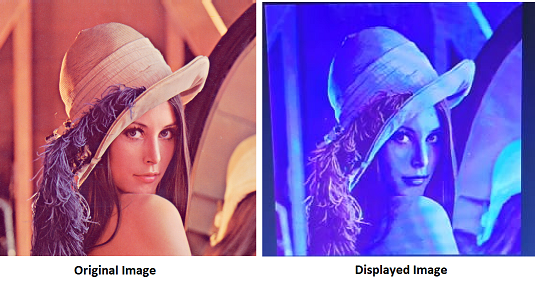

# Zynq7000 Video Interfacing

This repository documents Interfacing HDMI and VGA with Pynq Z2 Board using Vivado block design and RTL.

## Table of Contents

- [3-Bit VGA Interface RTL](#3-Bit-VGA-Interface-RTL)
- [12-Bit VGA Vivado Block Design](#12-Bit-VGA-Vivado-Block-Design)
- [HDMI Controller using RTL](HDMI-Controller-using-RTL)

## 3-Bit VGA Interface RTL

This is a simple project to control VGA monitor using Pynq Z2 board using verilog. This project makes use of HP 19ka monitor, optimal resolution supported by this monitor is 1366 x 768 at 60 Hz. The verilog source code includes logic to display 8 colour strip on the monitor.

Timings for this resolution are as follows

### Horizontal

* Active Pixels - 1366
* Total Pixels  - 1500
* Front Porch   - 14
* Sync Pulse    - 56
* Back Porch    - 64

### Vertical

* Active Pixels - 768
* Total Pixels  - 800
* Front Porch   - 1
* Sync Pulse    - 3
* Back Porch    - 28

Pixel Clock = 1500 x 800 x 60 = 72 MHz

Here each component (R, G, B) is 1 bit wide hence only 8 different colours are possible.

The Connection between the Board and VGA connector is as shown below.

### References

https://www.fpga4fun.com/PongGame.html/

## 12-Bit VGA Vivado Block Design

This is a simple project to control VGA monitor using Pynq Z2 board. This project makes use of vivado block design, the design tcl file is included in the repo. This project makes use of HP 19ka monitor, optimal resolution supported by this monitor is 1366 x 768 at 60 Hz. The repo also includes sdk source code to display lena 24-Bit bmp colour image on the monitor. VGA Interface takes analog input, here we are using 4 bits for each R, G, and B. The input data must be converted into analog data using some kind of DAC. Here we use 4 bit weighted resistor DAC.

The Connection between the Board and VGA connector is as shown below.

### Image Data Extraction

* The image needs to be opened in HXd hex editor tool, remove 54 bytes header incase of 24-Bit bmp image.
* Copy the HEX raw data and paste into a text file.
* Text file needs to be passed to image_extract.v in order to convert HEX data into decimal data.
* image_extract.v also inverts the image data array for proper displaying.
* Include the extracted image array in the sdk image_data.h file.

As we make use of only 4 bits out of 8 bits for displaying, some of details will be lost. The comparision between original image and displayed image is as shown below.

### References

https://www.youtube.com/watch?v=_o4FbVFLbuw&list=PLXHMvqUANAFOviU0J8HSp0E91lLJInzX1&index=38

## HDMI Controller using RTL

This is a simple project to control HDMI Display using Pynq Z2 board with the help of verilog. This project makes use of HP 19ka monitor, optimal resolution supported by this monitor is 1366 x 768 at 60 Hz. The verilog source code includes logic to display 8 colour strip on the monitor. As this monitor has only VGA interface a HDMI to VGA converter is used to connect the monitor.

Timings for this resolution are as follows

### Horizontal

* Active Pixels - 1366
* Total Pixels  - 1500
* Front Porch   - 14
* Sync Pulse    - 56
* Back Porch    - 64

### Vertical

* Active Pixels - 768
* Total Pixels  - 800
* Front Porch   - 1
* Sync Pulse    - 3
* Back Porch    - 28

Pixel Clock = 1500 x 800 x 60 = 72 MHz 
TMDS Clock = 10 x Pixel Clock = 720 MHz

### References

* https://forum.digikey.com/t/tmds-encoder-vhdl/12653
* https://www.fpga4fun.com/HDMI.html
